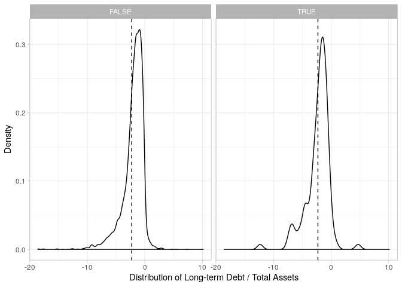
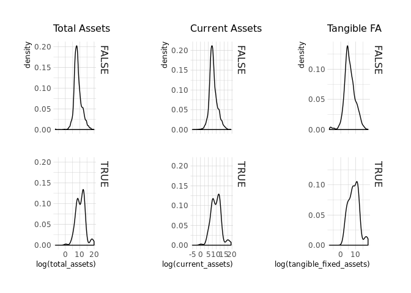

## Introduction

This is a guide to data collection for BSc students in (I)BA in the academic year 2019-2020. This guide attempts to explain the process of data collection and formatting in the context of a BSc project about political connections (see e.g. Fisman, 2001; Faccio, 2006). Various aspects of data collection and formatting are covered: first, data collection from the [BvD Amadeus database](https://amadeus.bvdinfo.com/version-2019919/home.serv?product=AmadeusNeo) to get information about firm performance and firm directors. Secondly, web scraping. I look for the names of (former) politicians from public sources (in this case, [Wikipedia](www.wikipedia.org)) and attempt to the names of the directors from Amadeus. I will use string matching algorithms to match politicians to board members as accurately as possible. In this way, a measure of political connections of firms is created. Finally, I tidy the data and compute several intuitive measurements of political connections and their relationship to financial performance. 


## Data collection from Amadeus BvD

Bureau van Dijk's Amadeus database (previously ORBIS) contains accounting, stock price and miscellaneous information about firms from all over the world. The database works on the basis of requests (much like SQL databases) via an online interface. You can formulate your request in combinations of various categories, making use of location, legal form, industry, and so on. For example, you can combine several queries to find 'European Union [28] listed non-financial companies'. In this example, I will focus on German non-financial companies and their board members, and their connections to German politicians in the current Bundestag. 

First, I specify the following search strategy:

- Location -> Region/Country/Region in Country -> Germany

- Legal form: Standardized Legal Form -> Public Limited Companies

- Industry & Activities -> Industry Classifications -> NACE Rev. 2 Main Sections -> All except K and L

This still leaves us with about 10,000 companies. A lot! I have also requested financial information for these companies from the book years 2017, 2018 and 2019, and a list of the names of all their directors. These will later be matched with the data on politicians collected and described in the next session. First, I will clean the Amadeus data to make it suitable for analysis, and find a nice way to facilitate string-matching. 

First, let's import the data. 


```r
library(readxl)

Amadeusdata <- read_excel("Amadeus_Export_1.xlsx", sheet = "Results")

names(Amadeusdata)
```

```
##  [1] "...1"                                       
##  [2] "Company name"                               
##  [3] "NACE code"                                  
##  [4] "Fixed assets\nth EUR\n2019"                 
##  [5] "Fixed assets\nth EUR\n2018"                 
##  [6] "Fixed assets\nth EUR\n2017"                 
##  [7] "Intangible fixed assets\nth EUR\n2019"      
##  [8] "Intangible fixed assets\nth EUR\n2018"      
##  [9] "Intangible fixed assets\nth EUR\n2017"      
## [10] "Tangible fixed assets\nth EUR\n2019"        
## [11] "Tangible fixed assets\nth EUR\n2018"        
## [12] "Tangible fixed assets\nth EUR\n2017"        
## [13] "Other fixed assets\nth EUR\n2019"           
## [14] "Other fixed assets\nth EUR\n2018"           
## [15] "Other fixed assets\nth EUR\n2017"           
## [16] "Current assets\nth EUR\n2019"               
## [17] "Current assets\nth EUR\n2018"               
## [18] "Current assets\nth EUR\n2017"               
## [19] "Stock\nth EUR\n2019"                        
## [20] "Stock\nth EUR\n2018"                        
## [21] "Stock\nth EUR\n2017"                        
## [22] "Debtors\nth EUR\n2019"                      
## [23] "Debtors\nth EUR\n2018"                      
## [24] "Debtors\nth EUR\n2017"                      
## [25] "Other current assets\nth EUR\n2019"         
## [26] "Other current assets\nth EUR\n2018"         
## [27] "Other current assets\nth EUR\n2017"         
## [28] "Cash & cash equivalent\nth EUR\n2019"       
## [29] "Cash & cash equivalent\nth EUR\n2018"       
## [30] "Cash & cash equivalent\nth EUR\n2017"       
## [31] "Total assets\nth EUR\n2019"                 
## [32] "Total assets\nth EUR\n2018"                 
## [33] "Total assets\nth EUR\n2017"                 
## [34] "Shareholders funds\nth EUR\n2019"           
## [35] "Shareholders funds\nth EUR\n2018"           
## [36] "Shareholders funds\nth EUR\n2017"           
## [37] "Capital\nth EUR\n2019"                      
## [38] "Capital\nth EUR\n2018"                      
## [39] "Capital\nth EUR\n2017"                      
## [40] "Other shareholders funds\nth EUR\n2019"     
## [41] "Other shareholders funds\nth EUR\n2018"     
## [42] "Other shareholders funds\nth EUR\n2017"     
## [43] "Non-current liabilities\nth EUR\n2019"      
## [44] "Non-current liabilities\nth EUR\n2018"      
## [45] "Non-current liabilities\nth EUR\n2017"      
## [46] "Long term debt\nth EUR\n2019"               
## [47] "Long term debt\nth EUR\n2018"               
## [48] "Long term debt\nth EUR\n2017"               
## [49] "Other non-current liabilities\nth EUR\n2019"
## [50] "Other non-current liabilities\nth EUR\n2018"
## [51] "Other non-current liabilities\nth EUR\n2017"
## [52] "Provisions\nth EUR\n2019"                   
## [53] "Provisions\nth EUR\n2018"                   
## [54] "Provisions\nth EUR\n2017"                   
## [55] "Current liabilities\nth EUR\n2019"          
## [56] "Current liabilities\nth EUR\n2018"          
## [57] "Current liabilities\nth EUR\n2017"          
## [58] "Loans\nth EUR\n2019"                        
## [59] "Loans\nth EUR\n2018"                        
## [60] "Loans\nth EUR\n2017"                        
## [61] "Creditors\nth EUR\n2019"                    
## [62] "Creditors\nth EUR\n2018"                    
## [63] "Creditors\nth EUR\n2017"                    
## [64] "Other current liabilities\nth EUR\n2019"    
## [65] "Other current liabilities\nth EUR\n2018"    
## [66] "Other current liabilities\nth EUR\n2017"    
## [67] "Total shareh. funds & liab.\nth EUR\n2019"  
## [68] "Total shareh. funds & liab.\nth EUR\n2018"  
## [69] "Total shareh. funds & liab.\nth EUR\n2017"  
## [70] "DM\nFull name"
```

Secondly, we want to separate financial data from data about directors. Let's therefore create two new dataframes, one containing the financial data, and the other containing a list of directors for each company. 


```r
Financial <- Amadeusdata[!is.na(Amadeusdata[,2]),]
  
# Next, I "fill in" the dataset by adding the name for each company
library(zoo)
Amadeusdata[,2] <- na.locf(Amadeusdata[,2])

# Now, I extract only the dataset with directors
Directors <- Amadeusdata[,c(2,70)]

# Because there are a lot of duplicates, I want to filter 
# the dataset to unique observations
Directors <- unique(Directors)

#This is what the Directors data set looks like now:
library(kableExtra)

Directors %>%
  head() %>%
  kable(caption = "Company - Director",booktabs = TRUE, row.names = FALSE) %>%
  kable_styling(latex_options = "striped")
```

<table class="table" style="margin-left: auto; margin-right: auto;">
<caption>Company - Director</caption>
 <thead>
  <tr>
   <th style="text-align:left;"> Company name </th>
   <th style="text-align:left;"> DM
Full name </th>
  </tr>
 </thead>
<tbody>
  <tr>
   <td style="text-align:left;"> VOLKSWAGEN AKTIENGESELLSCHAFT </td>
   <td style="text-align:left;"> Mr Andreas Hermann Renschler </td>
  </tr>
  <tr>
   <td style="text-align:left;"> VOLKSWAGEN AKTIENGESELLSCHAFT </td>
   <td style="text-align:left;"> Dipl.-Wirtschaftsingenieur (FH) Hans Dieter Pötsch </td>
  </tr>
  <tr>
   <td style="text-align:left;"> VOLKSWAGEN AKTIENGESELLSCHAFT </td>
   <td style="text-align:left;"> Mr Jörg Hofmann </td>
  </tr>
  <tr>
   <td style="text-align:left;"> VOLKSWAGEN AKTIENGESELLSCHAFT </td>
   <td style="text-align:left;"> H.E. Dr. حسين على العبد الله </td>
  </tr>
  <tr>
   <td style="text-align:left;"> VOLKSWAGEN AKTIENGESELLSCHAFT </td>
   <td style="text-align:left;"> Dr. حسى سلطان جابر </td>
  </tr>
  <tr>
   <td style="text-align:left;"> VOLKSWAGEN AKTIENGESELLSCHAFT </td>
   <td style="text-align:left;"> Dr. Politikwissenchaft Bernd Walter Althusmann </td>
  </tr>
</tbody>
</table>

```r
#I clean the names of the dataset to facilitate later programming
library(janitor)
Directors <- clean_names(Directors)
```

## Data collection from Wikipedia

I use the r package `rvest` and its read_html and related functions to scrape the table from the following Wikipedia page: https://en.wikipedia.org/wiki/List_of_members_of_the_19th_Bundestag. I will end up with a table containing all the information, which requires a little bit of cleaning.


```r
library(rvest)
library(dplyr)
source <- read_html(
  "https://en.wikipedia.org/wiki/List_of_members_of_the_19th_Bundestag")


bundestag <- as.data.frame(source %>%
  html_nodes("table.wikitable:nth-child(8)") %>%
  html_table(fill=TRUE))

head(bundestag)
```

```
##   Image                 Name Year.of.birth Party  Party.1              State
## 1    NA Michael von Abercron       1952[1]    NA      CDU Schleswig-Holstein
## 2    NA      Doris Achelwilm       1976[3]    NA The Left             Bremen
## 3    NA  Grigorios Aggelidis       1965[4]    NA      FDP       Lower Saxony
## 4    NA        Gökay Akbulut       1982[5]    NA The Left  Baden-Württemberg
## 5    NA       Stephan Albani       1968[6]    NA      CDU       Lower Saxony
## 6    NA           Renata Alt       1965[7]    NA      FDP  Baden-Württemberg
##   Constituency..for.directly.elected.members.
## 1                                   Pinneberg
## 2                                            
## 3                                            
## 4                                            
## 5                                            
## 6                                            
##   Constituency.vote.percentage..for.directly.elected.members. Remarks
## 1                                                   39.7 %[2]        
## 2                                                                    
## 3                                                                    
## 4                                                                    
## 5                                                                    
## 6
```

I use the `janitor` package to clean the variable names, which makes it a little bit easier and helps to keep oversight of the data. 


```r
bundestag <- 
  bundestag %>%
  clean_names()
```
As you can see, apart from the names of all MPs, this table contains a lot of useful information, such as the electoral margin in their constituency (if applicable), their age (year of birth), and their political party and state. There are also some observations that contain links to the German wikipedia, indicated by parts of the string [de], etc., which we want to remove. I make use of [Regular Expressions](https://en.wikipedia.org/wiki/Regular_expression) to find the common pattern in the strings which I want to replace. 


```r
library(stringr)

bundestag$name <- str_replace(bundestag$name,"\\s\\[(.+)","")

bundestag$year_of_birth <- str_replace(bundestag$year_of_birth,"\\[(.+)","")

bundestag$constituency_for_directly_elected_members <- str_replace(bundestag$constituency_for_directly_elected_members,"\\s\\[(.+)","")

bundestag$constituency_vote_percentage_for_directly_elected_members <- str_replace(bundestag$constituency_vote_percentage_for_directly_elected_members,"\\s%(.+)","")
```

And there we go! Now everything should be reasonably clean to match the names with the names from the directorates, which we downloaded from Amadeus. 


```r
bundestag %>%
  group_by(state) %>%
  summarize(count = n()) %>%
  kable(caption = "How many politicians per state?",booktabs = TRUE, row.names = FALSE) %>%
  kable_styling(latex_options = "striped")
```

<table class="table" style="margin-left: auto; margin-right: auto;">
<caption>How many politicians per state?</caption>
 <thead>
  <tr>
   <th style="text-align:left;"> state </th>
   <th style="text-align:right;"> count </th>
  </tr>
 </thead>
<tbody>
  <tr>
   <td style="text-align:left;"> Baden-Württemberg </td>
   <td style="text-align:right;"> 96 </td>
  </tr>
  <tr>
   <td style="text-align:left;"> Bavaria </td>
   <td style="text-align:right;"> 108 </td>
  </tr>
  <tr>
   <td style="text-align:left;"> Berlin </td>
   <td style="text-align:right;"> 28 </td>
  </tr>
  <tr>
   <td style="text-align:left;"> Brandenburg </td>
   <td style="text-align:right;"> 25 </td>
  </tr>
  <tr>
   <td style="text-align:left;"> Bremen </td>
   <td style="text-align:right;"> 6 </td>
  </tr>
  <tr>
   <td style="text-align:left;"> Hamburg </td>
   <td style="text-align:right;"> 16 </td>
  </tr>
  <tr>
   <td style="text-align:left;"> Hesse </td>
   <td style="text-align:right;"> 50 </td>
  </tr>
  <tr>
   <td style="text-align:left;"> Lower Saxony </td>
   <td style="text-align:right;"> 66 </td>
  </tr>
  <tr>
   <td style="text-align:left;"> Mecklenburg-Vorpommern </td>
   <td style="text-align:right;"> 16 </td>
  </tr>
  <tr>
   <td style="text-align:left;"> North Rhine-Westphalia </td>
   <td style="text-align:right;"> 142 </td>
  </tr>
  <tr>
   <td style="text-align:left;"> Rhineland-Palatinate </td>
   <td style="text-align:right;"> 37 </td>
  </tr>
  <tr>
   <td style="text-align:left;"> Saarland </td>
   <td style="text-align:right;"> 10 </td>
  </tr>
  <tr>
   <td style="text-align:left;"> Saxony </td>
   <td style="text-align:right;"> 38 </td>
  </tr>
  <tr>
   <td style="text-align:left;"> Saxony-Anhalt </td>
   <td style="text-align:right;"> 23 </td>
  </tr>
  <tr>
   <td style="text-align:left;"> Schleswig-Holstein </td>
   <td style="text-align:right;"> 26 </td>
  </tr>
  <tr>
   <td style="text-align:left;"> Thuringia </td>
   <td style="text-align:right;"> 22 </td>
  </tr>
</tbody>
</table>

## String matching

I will match the two sections of names by employing a technique called fuzzy string matching. To read more about string-matching, please refer to [this link](https://www.r-bloggers.com/fuzzy-string-matching-a-survival-skill-to-tackle-unstructured-information/). In short, I will use it to compute the distances between any board member and any member of parliament, and if the distance is 'close' enough (subjectively defined in the `maxDist = 3` argument), I will consider it as a match, meaning that the board member is also an MP. 


```r
#String-matching
library(stringdist)

matches <- amatch(Directors$dm_full_name, bundestag$name, maxDist = 3)

Directors <- Directors %>%
  mutate(matchname = bundestag$name[matches])
```

After a short manual inspection of the data, we can see that the matches are near perfect and there are no false flags..  


```r
Directors[!is.na(Directors$matchname),] %>%
  head() %>%
  kable(caption = "String Distances",booktabs = TRUE, row.names = FALSE) %>%
  kable_styling(latex_options = "striped")
```

<table class="table" style="margin-left: auto; margin-right: auto;">
<caption>String Distances</caption>
 <thead>
  <tr>
   <th style="text-align:left;"> company_name </th>
   <th style="text-align:left;"> dm_full_name </th>
   <th style="text-align:left;"> matchname </th>
  </tr>
 </thead>
<tbody>
  <tr>
   <td style="text-align:left;"> VOLKSWAGEN AKTIENGESELLSCHAFT </td>
   <td style="text-align:left;"> Mr Christian Schmidt </td>
   <td style="text-align:left;"> Christian Schmidt </td>
  </tr>
  <tr>
   <td style="text-align:left;"> BASF SE </td>
   <td style="text-align:left;"> Mr Heiko Maas </td>
   <td style="text-align:left;"> Heiko Maas </td>
  </tr>
  <tr>
   <td style="text-align:left;"> DEUTSCHE BAHN AKTIENGESELLSCHAFT </td>
   <td style="text-align:left;"> Ms Kirsten Lühmann </td>
   <td style="text-align:left;"> Kirsten Lühmann </td>
  </tr>
  <tr>
   <td style="text-align:left;"> DEUTSCHE BAHN AKTIENGESELLSCHAFT </td>
   <td style="text-align:left;"> Mr Stefan Müller </td>
   <td style="text-align:left;"> Stefan Müller </td>
  </tr>
  <tr>
   <td style="text-align:left;"> DEUTSCHE BAHN AKTIENGESELLSCHAFT </td>
   <td style="text-align:left;"> Mr Eckhardt Rehberg </td>
   <td style="text-align:left;"> Eckhardt Rehberg </td>
  </tr>
  <tr>
   <td style="text-align:left;"> DEUTSCHE BAHN AKTIENGESELLSCHAFT </td>
   <td style="text-align:left;"> Mr Oliver Wittke </td>
   <td style="text-align:left;"> Oliver Wittke </td>
  </tr>
</tbody>
</table>

```r
dim(Directors[!is.na(Directors$matchname),])
```

```
## [1] 119   3
```


We have 119 politician-board combinations members! That means that 0.1680791 = 16% of the Bundestag members are member of a Board of a publicly listed company, if we assume that one politician is on one board, which is a quite significant amount! (We will later check the validity of this assumption). On the other hand, only a very small percentage, 0.0016274 < 0.1% of the Board members is a politician, which is to be expected. 

## Matching politicians to companies

Now, our task is to get indicators of political connections in the `Financial` dataset. I use two definitions of political connections for a firm-year observations:

- An indicator whether a firm has 1 or more board members who are also politicians

- A variable of how many board members are also politicians

In practice, these two variables should be very highly correlated - something we can test very soon. 

To start off, let's take the matches, and see to which firm they belong:


```r
Companies <- Directors %>%
  group_by(company_name) %>%
  summarise(count = sum(!is.na(matchname)))

dim(Companies[Companies$count != 0,])
```

```
## [1] 114   2
```

```r
# Given that 114 companies and 119 politicians are connected, this means some politicians have more 
# than one board position! 
```

Matching to companies is now very easy:


```r
Financial <- left_join(Financial, Companies, by = c(`Company name` = "company_name"))
```
It would also be possible to match political party of the connections, and electoral results, to the firms to which the politicians are connected. This is not difficult, but I leave it to the reader to do this exercise. 

## Tidying the Financial dataset

Next, we must tidy the data so that it can be used for analysis. I have other resources on how to do this, but here, I will show it again: 


```r
library(tidyverse)
Financial <- Financial[,-c(1,70)]
Financial <- Financial %>%
  pivot_longer(3:68, names_to = "variable", values_to = "value")

#Extract the year column
Financial$year <- as.numeric(str_extract(Financial$variable, "[0-9]+"))

# Remove "th.EUR" from the string
Financial$variable <- sub("\\sth\\sEUR","", 
                        Financial$variable)

# Remove the years from the variable string
Financial$variable <- sapply(
  str_extract_all(
      Financial$variable,"[aA-zZ]+"), 
  paste, collapse = "_")

# Convert value to numeric
Financial$value <- as.numeric(Financial$value)

#Wider format
Final <- pivot_wider(data = Financial, names_from = variable, values_from = value, values_fn = list(value = mean))


#Clean variable names
library(janitor) 

Final <- Final %>%
  clean_names()
```


## Finish! - Some preliminary analysis

Now, we can reap the benefits of our work and do some analysis. For example, are firms with political connections more leveraged than others?


```r
# Let's make a graph comparing politically connected firms to those that are not, and compare them

Final %>%
  mutate(countgrzero = count > 0) %>%
  ggplot(aes(x = log(long_term_debt/total_assets))) + 
  geom_density() + 
  facet_wrap(.~countgrzero) + 
  geom_vline(xintercept = median(log(Final$long_term_debt/Final$total_assets), na.rm = TRUE), 
             linetype = "dashed") + theme_light() +
  xlab("Distribution of Long-term Debt / Total Assets") + ylab("Density")
```

<!-- -->

Let's now do a small regression analysis. 


```r
#Create several variables
Final$lev <- Final$long_term_debt/Final$total_assets
Final$currat <- Final$current_assets/Final$total_assets
Final$clca <- Final$current_liabilities/Final$current_assets

#Estimate the models
model1 <- lm(data = Final, lev ~ count)
model2 <- lm(data = Final, lev ~ count + currat)


#Filter some observations out
test <- Final[which(!is.nan(Final$clca) & !is.na(Final$clca) & !is.infinite(Final$clca)),]

#Final model
model3 <- lm(data = test, lev ~ count + currat + clca)
```


```r
library(stargazer)
stargazer(model1, model2, model3, header = F,
          title = "Regression Models", type = "html")
```


<table style="text-align:center"><caption><strong>Regression Models</strong></caption>
<tr><td colspan="4" style="border-bottom: 1px solid black"></td></tr><tr><td style="text-align:left"></td><td colspan="3"><em>Dependent variable:</em></td></tr>
<tr><td></td><td colspan="3" style="border-bottom: 1px solid black"></td></tr>
<tr><td style="text-align:left"></td><td colspan="3">lev</td></tr>
<tr><td style="text-align:left"></td><td>(1)</td><td>(2)</td><td>(3)</td></tr>
<tr><td colspan="4" style="border-bottom: 1px solid black"></td></tr><tr><td style="text-align:left">count</td><td>-2.656</td><td>-1.769</td><td>-1.767</td></tr>
<tr><td style="text-align:left"></td><td>(23.199)</td><td>(23.248)</td><td>(23.260)</td></tr>
<tr><td style="text-align:left"></td><td></td><td></td><td></td></tr>
<tr><td style="text-align:left">currat</td><td></td><td>7.098</td><td>7.107</td></tr>
<tr><td style="text-align:left"></td><td></td><td>(11.978)</td><td>(12.020)</td></tr>
<tr><td style="text-align:left"></td><td></td><td></td><td></td></tr>
<tr><td style="text-align:left">clca</td><td></td><td></td><td>0.0001</td></tr>
<tr><td style="text-align:left"></td><td></td><td></td><td>(0.023)</td></tr>
<tr><td style="text-align:left"></td><td></td><td></td><td></td></tr>
<tr><td style="text-align:left">Constant</td><td>3.917</td><td>-0.944</td><td>-0.950</td></tr>
<tr><td style="text-align:left"></td><td>(3.384)</td><td>(8.872)</td><td>(8.908)</td></tr>
<tr><td style="text-align:left"></td><td></td><td></td><td></td></tr>
<tr><td colspan="4" style="border-bottom: 1px solid black"></td></tr><tr><td style="text-align:left">Observations</td><td>7,521</td><td>7,521</td><td>7,515</td></tr>
<tr><td style="text-align:left">R<sup>2</sup></td><td>0.00000</td><td>0.00005</td><td>0.00005</td></tr>
<tr><td style="text-align:left">Adjusted R<sup>2</sup></td><td>-0.0001</td><td>-0.0002</td><td>-0.0004</td></tr>
<tr><td style="text-align:left">Residual Std. Error</td><td>290.906 (df = 7519)</td><td>290.919 (df = 7518)</td><td>291.054 (df = 7511)</td></tr>
<tr><td style="text-align:left">F Statistic</td><td>0.013 (df = 1; 7519)</td><td>0.182 (df = 2; 7518)</td><td>0.121 (df = 3; 7511)</td></tr>
<tr><td colspan="4" style="border-bottom: 1px solid black"></td></tr><tr><td style="text-align:left"><em>Note:</em></td><td colspan="3" style="text-align:right"><sup>*</sup>p<0.1; <sup>**</sup>p<0.05; <sup>***</sup>p<0.01</td></tr>
</table>

As a second example, we can ask, are firms with political connections bigger than firms that do not?


```r
library(hrbrthemes)
p1 <- Final %>%
  mutate(countgrzero = count > 0) %>%
  ggplot(aes(x = log(total_assets))) + geom_density() + theme_ipsum_ps() +
  theme(plot.title = element_text(size=12)) + labs(title = "Total Assets") + facet_grid(rows = vars(countgrzero))

p2 <- Final %>%
  mutate(countgrzero = count > 0) %>%
  ggplot(aes(x = log(current_assets))) + geom_density() + theme_ipsum_ps() +
  theme(plot.title = element_text(size=12)) + ggtitle("Current Assets") + facet_grid(rows = vars(countgrzero))

p3 <- Final %>%
  mutate(countgrzero = count > 0) %>%
  ggplot(aes(x = log(tangible_fixed_assets))) + geom_density() + theme_ipsum_ps() +
  theme(plot.title = element_text(size=12)) + ggtitle("Tangible FA") + facet_grid(rows = vars(countgrzero))

library(egg)
grid.arrange(p1,p2,p3, ncol = 3)
```

<!-- -->

Thank you for reading. 


