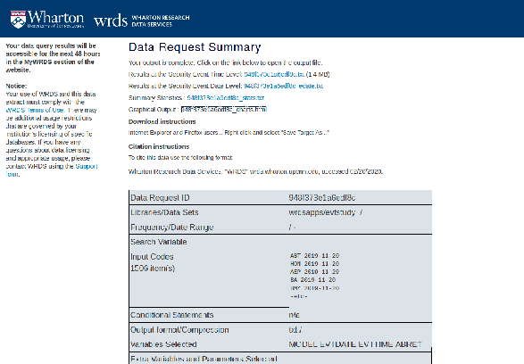
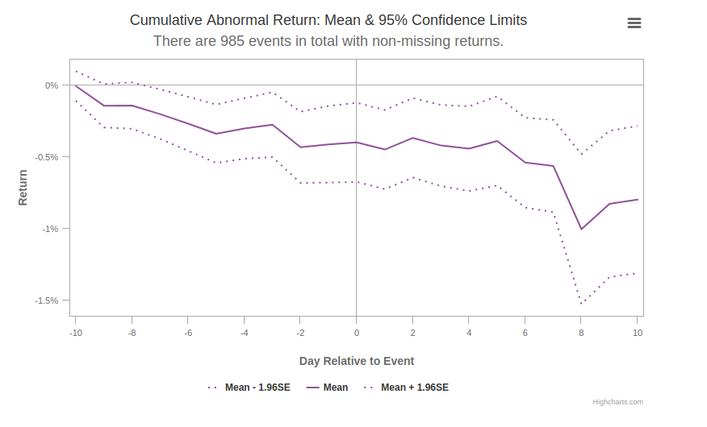
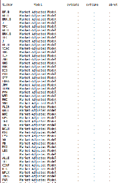

```{r setup, include=FALSE}
knitr::opts_chunk$set(echo = TRUE)

library(tidyverse)
library(readxl)
library(lubridate)
library(kableExtra)
```

## Introduction

In this document, I will briefly show how to obtain data from CRSP, and format it using R. Please take note that there are countloss other possibilities to do this. In any case, I show how to get data from all the companies of the S&P 500 and Amsterdam AEX Index. It is convenient to execute the process into two steps. First, you look up the tickers or other company identifiers using Compustat's CapitalIQ database. Then, you retrieve the actual stock price series, or execute an event study using the CRSP database. 

This manual is partially based on the simpler, but more general EUR manual: https://datateamoftheeur.files.wordpress.com/2016/07/stock_prices-crsp.pdf 

## Part 1: S&P 500
First, we get a day pass from CRSP (you can access it through the EUR network, or through VPN). Then, we click on the link provided in the email. Then, we go to the upper right, and click 'Get Data'. Then, we scroll down, and click Compustat CapitalIQ. Under Compustat, we can click either North America - Daily (in this case), or perhaps Global - Daily (in the subsequent case where we focus on the AEX index). Then, we click index constituents, and we pick a date range.

In this case, I picked a date range from Nov 2019 to Jan 2020. This means that I will retrieve the company information for all companies that belonged to the S&P 500 in that period. It might be, of course, that this number is larger than 500, as some companies might have entered the S&P 500 and others might have left. 

Under step 2, we click on **Code Lookup**. A pop-up menu will show, and we search for 'S&P 500'. As a return to the query, we get various indices. The correct one is `S&P 500 Comp-Ltd`. We tick the small box on the left, click 'Ticker' under 'Select your Identifier', and press 'Add codes to list'. Then, we scroll down and click 'Add Codes to Query, and click OK. The menu disappears. 


In step 3, we select the **Company Information** that we want, which allows us to identify the companies: Company Name, Constituent Ticker, and if we want to be sure, we might also want to retrieve CUSIP, CIK, the SIC Code, etc. We ignore the conditional statements, and select an output according to our liking. I selected .csv, no compression type, and date format YYMMDDn8. You can freely vary all of these options. 

I click `Submit Query`. 

Now, I can download the query in a .csv (an easy to store, efficient file format which can be read by Excel, Stata, R and other programs). I saved the file as `senp.csv`, and read it in R using the `read.csv` command. 

```{r}
senp <- read.csv("senp.csv")
```

Then, I convert the from and thru variables to dates. The `from` and `thru` variables indicate from what time they became constituents of the index, and, if applicable, when they left the index. It is important that R recognise them as date, because otherwise we cannot look up the appropriate companies later, and use the filter function. 

The format of the dates can be any, but I use the standard format in R, YYYY-mm-dd, in all digits. 

```{r}
senp <- senp %>%
  mutate(from = as.Date(as.character(senp$from),format="%Y%m%d"),
         thru = as.Date(as.character(senp$thru), format = "%Y%m%d")
         )
```

Now, I create three subdatasets, each one for each month, because there are three events that happen in three months.  

```{r}
november <- senp %>%
  filter(from < "2019-11-01",
         is.na(thru) | thru > "2019-12-01")

december <- senp %>%
  filter(from < "2019-12-01",
         is.na(thru) | thru > "2020-12-31")

january <- senp %>%
  filter(from < "2020-01-01",
         is.na(thru) | thru > "2020-01-31")
```

Finally, I want to have datasets in which I want to obtain ONLY the company identifiers which I can use as input to retrieve their stock prices. I remove all the unnecessary information, so the files can serve as an input in CRSP to retrieve stock prices. 

```{r}
#Bind all dataframes together
months <- list(november, december, january)

#Select the 7th column, the ticker of all dateframes (in principle you only need the one with the ticker, for example)
months <- lapply(months, select, 7)

november <- months[[1]]
december <- months[[2]]
january <- months [[3]]
```

Now, november, december and january contain the tickers for all companies that belong to the S&P 500 in that month. 

## How to use this as an event study input file?

Now, we suppose that the event in November we are investigate happens at "2019-11-20" (so 20th of November), in December, at 5th of December, and in January, on Jan 24. Let's program this into R first:

```{r}
#This is a long list of tickers
tickers <- rbind(november, december, january)

#This is a long list of event dates corresponding to the event in each month
datesnovember <- data.frame(date = rep("2019-11-20", nrow(november)))
datesdecember <- data.frame(date = rep("2019-12-05", nrow(december)))
datesjanuary <- data.frame(date = rep("2020-01-24" , nrow(january)))

dates <- rbind(datesnovember, datesdecember, datesjanuary)


#This is a data.frame that binds them together
crspinput <- cbind(tickers, dates)
```

This is what the result looks like. 

```{r}
kable(head(crspinput,10), row.names = FALSE) %>%
  kable_styling(latex_options = "striped")
```

Now, let's write the result to a csv file, so we can upload it in the event study tool. The quote = FALSE option is very important, because CRSP will not read the data with quotation marks. 

```{r}
write.table(crspinput, 
            "crspinput.txt", 
            row.names=FALSE, 
            col.names = FALSE,
            sep = " ",
            quote = FALSE)
```

Finally, we can use this file in the Event study tool (Eventus) on CRSP. We go to Home > Get Data > Event Study by WRDS (under the header WRDS Products). You select one of the event studies that you want to perform. In this case, we select **U.S. Daily Event Study: Upload your own events**. 

In step 1, we select PERMNO, CUSIP or Ticker (depending on which of these we retrieved earlier on), and the appropriate date format. 

Under input file, we upload the file which we just created (`crspinput.txt`). 

Then, we select an appropriate risk model (you have to find out for yourself what these are), and specify the estimation window. Finally, we select the information that we are interested in in step 4 (the defaults are interesting enough, but you are encouraged to look for more options), and click `Submit Query`. 


## The Results 
We will then end up with this menu of results:



where we can pick which results we want.

Second, we will see a nice graph, like this:



which summarizes the event study over all three events (is this what we want?)

Third, we will get the data resulting from the event study, in various forms:



## Data treatment

I download the data and save it as `results.txt`. 

```{r}
results <- read.table("results.txt", skip = 4)
results <- results[,-3]
names(results) <- c("ticker","model","evtdate","evttime","abret")
```

There are many things you can (and should) do with these data, but I will just limit myself to verifying whether the automatically generated graph is reproducible using the data at our disposal:


```{r}
results <- results %>%
  filter(abret != ".", evttime != ".") %>%
  mutate(abret = as.numeric(as.character(abret)), evttime = as.numeric(as.character(evttime))) %>%
  arrange(evttime) 

#Calculate the cumulative abnormalreturns
#Argument 1 is the value over which to apply argument, 
#Argument 2 and 3 are the categories, 
#Argument 4 is what to apply, i.e. the cumulative sum
results$car <- ave(results$abret, results$ticker, results$evtdate, FUN = cumsum)
```

Now, we plot the graph of average CAR's:

```{r}
results %>%
  group_by(evttime) %>%
  summarise(mean = mean(car)) %>%
  ggplot(aes(x = evttime, y = mean)) + geom_line()
```


.. and it seems to perfectly correspond to the previous automatically-generated graph. Thank you for reading. 
